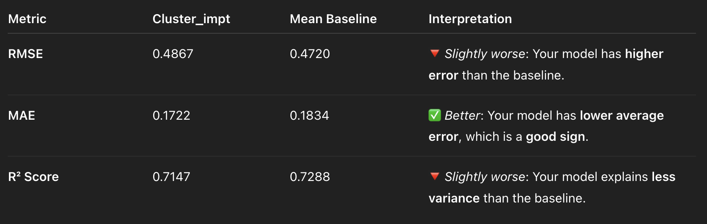

### 📌 **Model**: Clustering Imputation (via GMM / EM Algorithm)

**Description**: Missing values were initially filled with modal values. Then, the data was clustered using the **Expectation-Maximization algorithm** (Gaussian Mixture Models). Within each cluster, missing ratings were imputed using the **mean of observed ratings**.

---

#### 🔹 **Experiment 1**

* **Condition**: `k = 11`, selected based on **AIC**
* **Observation**:

  * MAE is slightly better than the mean baseline.
  * RMSE and R² are slightly worse.
  * Overall, performance is **not significantly better** than imputing using the global mean.

---

#### 🔹 **Experiment 2**

* **Condition**: `k = 9`, selected based on **BIC**
* **Observation**:

  * Again, **MAE shows minor improvement**, but **RMSE is higher** and **R² is lower**.
  * Implies that **clustering via EM provides limited benefit** under this condition.

---
